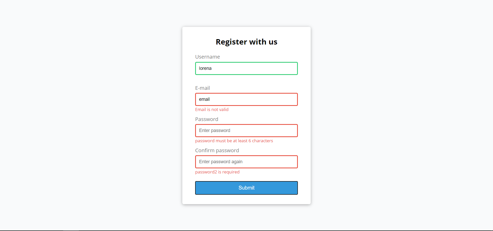

<h1 align="center">
    
</h1>

<h4 align="center"> 
	FormValidator
</h4>

  

  	
  
  

  
   

## 💻 Sobre o projeto

📚 Form validator - é um simples formulário com validação dos campos.

O usuário poderá escrever em quatro campos diferentes onde
- O campo Username avisa se estiver vazio, se tiver menos que 3 caracteres e mais que 20 caracteres
- O campo E-mail verifica o formato de email e estiver vazio
- O campo senha verifica se estiver vazio, se tiver menos que 6 caracteres e mais que 25 caracteres e se as senhas são compatíveis
 

## 🛠 Tecnologias

As seguintes ferramentas foram usadas na construção do projeto:

- [HTML]
- [CSS]
- [JS]
